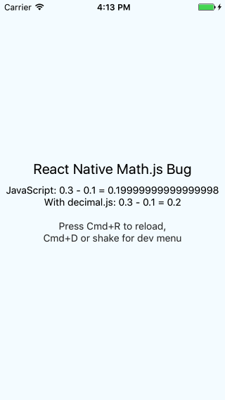
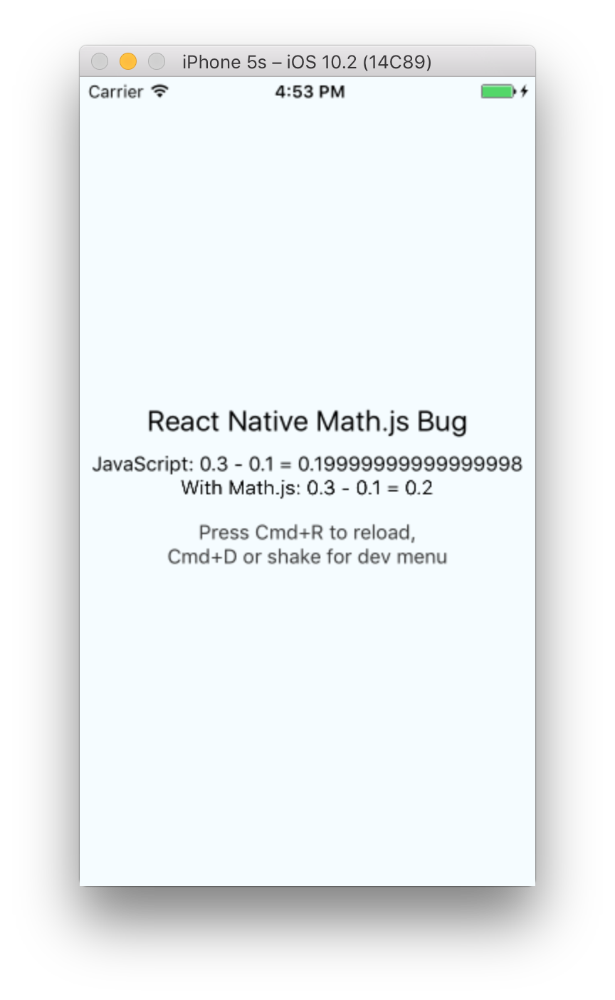

This is a sample React Native project to demonstrate a bug when [Math.js](https://github.com/josdejong/mathjs) is used as a dependency.

### Summary
When Math.js is used as a dependency in a [React Native](https://facebook.github.io/react-native/) project a production bundle cannot be created by the React Native packager. I think the issue could be solved if Math.js would update it's [decimal.js](https://github.com/MikeMcl/decimal.js) dependancy from v5.0.8 to v7.1.1.

Related GitHub issues:

* <https://github.com/facebook/react-native/issues/10816>
* <https://github.com/MikeMcl/decimal.js/pull/42>
* <https://github.com/MikeMcl/decimal.js/issues/5>
* <https://github.com/facebook/react-native/issues/4968>

### Dependencies
Make sure the below dependencies are installed. See [these instructions](https://facebook.github.io/react-native/docs/getting-started.html#content).

* Xcode
* Node v6.9.1
* Watchman v4.7.0
* react-native-cli v1.0.0

### Installation instructions
In a terminal:

1. Clone the repository to your computer: `git clone https://github.com/jonrh/react-native-mathjs-bug.git`
2. Move into the project folder: `cd react-native-mathjs-bug`
3. Install [npm] dependencies: `npm install`
4. To run the project in an iOS simulator: `react-native run-ios`
5. To make a production bundle of the app: 

	```
	react-native bundle --dev=false --platform=ios --entry-file=index.ios.js --bundle-output something.jsbundle
	```
	
### Investigations
1. In commit 185151fa36ee01c30dbb267fc77f9ae77bfc80be I confirmed that [decimal.js](https://github.com/MikeMcl/decimal.js) worked as expected with React Native [thanks to an update](https://github.com/MikeMcl/decimal.js/pull/42) in v7.0.0. The app could be run in a simulator and the production bundle creation succeeded.

	<p align="center">
		
	</p>

2. Next I downgraded to decimal.js v5.0.8 (in commit 628db354628147280a3d4b9b871385549a8a8340), the same as Math.js [is using](https://github.com/josdejong/mathjs/blob/master/package.json#L79) at the time of writing. I deleted the node_modules/ folder and ran `npm install` again. The app works correctly in development mode in the iOS simulator but when running the production bundle command (installation instruction #5) the following error is produced:

	```
	➜ react-native-mathjs-bug git:(master) ✗ react-native bundle --dev=false --platform=ios --entry-file=index.ios.js --bundle-output 	something.jsbundle
	Loading dependency graph, done.

	Unable to resolve module crypto from /Users/jonrh/Desktop/react-native-mathjs-bug/node_modules/decimal.js/decimal.js:
	Module does not exist in the module map or in these directories: /Users/jonrh/Desktop/react-native-mathjs-bug/node_modules

	This might be related to https://github.com/facebook/react-native/issues/4968
	To resolve try the following:
		1. Clear watchman watches: `watchman watch-del-all`.
		2. Delete the `node_modules` folder: `rm -rf node_modules && npm install`.
		3. Reset packager cache: `rm -fr $TMPDIR/react-*` or `npm start -- --reset-cache`.
	```
	
	Thus confirming the issue/conflict exits in decimal.js v5.0.8 but not in the latest version.
	
3. Next I removed the dependency to decimal.js, deleted node_modules/, ran `npm install` and then `npm install mathjs --save`. The thing applies for Math.js v3.9.2 as decimal v5.0.8. The app works correctly when built for development and thus works as expected in the iOS simulator. However when built for production the React Native packager falters just as it did with decimal.js v5.0.8 here above with he same error message.

	<p align="center">
		
	</p>